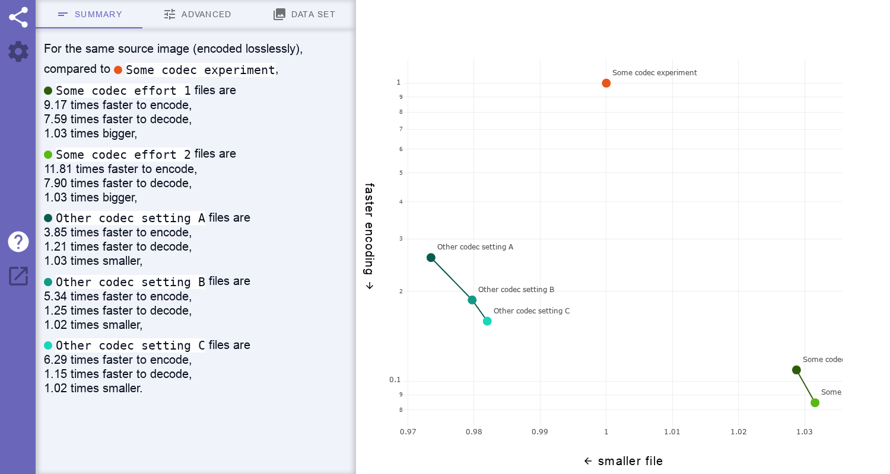

# Codec-Compare

Codec-Compare is a static front-end framework presenting and aggregating
performance data, in order to compare the codecs that were used to generate that
data.

Input data is expected to be in [JSON format](#plug-data-at-serve-time). It is
aggregated based on some fields used as matchers. Stats are computed and plotted
for the fields selected as metrics:



The intent is a tool that is both novice-friendly, so that anyone landing on the
page can understand what is shown, but also useful to experts, by offering a
convenient interactive user interface with matcher, metric and filter settings.
The presented data should be easily reproducible and up-to-date.

Feel free to file an issue for any question, suggestion or bug report.
Contributions are also welcome, see [CONTRIBUTING](CONTRIBUTING.md).

## Build and run

Follow these instructions after cloning this repository to build the static
framework.

Install `npm`: https://docs.npmjs.com/downloading-and-installing-node-js-and-npm

From the project root directory, install the project's dependencies:

```sh
npm install
```

### Development

To build and immediately view the framework in a browser:

```sh
npm run dev
```

### Production

To only build:

```sh
npm run build
```

Files are generated in `dist/`. They can be served as is, for example with
`npm run preview` (from root folder) or `python3 -m http.server` (from `dist/`
folder).

## Advanced

### Structure

Codec-Compare has:

  - A main landing page `index.html`.
  - An image viewer `visualizer.html`.
  - [Typescript](https://www.typescriptlang.org)
    [web components](https://developer.mozilla.org/en-US/docs/Web/Web_Components)
    in `src/`.
  - A dependency on [Lit](https://lit.dev).
  - A dependency on [Plotly.js](https://plotly.com/javascript/).
  - A dependency on
    [Material Web Components](https://github.com/material-components/material-web).
  - A dependency on [Material Icons](https://fonts.google.com/icons).
  - Graphical assets and demo placeholders in `assets/`.
  - A `package.json` project configuration file (used by `npm install`).
  - A `tsconfig.json` TypeScript configuration file (used by `npm run dev` and
    `npm run build`).
  - A `vite.config.js` Vite configuration file (used by `npm run dev` and `npm
    run build`).
  - A `karma.conf.js` Karma configuration file (used by `npm run test`).

Note: See
https://lit.dev/docs/components/properties/#avoiding-issues-with-class-fields
for why `useDefineForClassFields` is set to `false` in `tsconfig.json`.

### Plug data at serve time

For each batch of data, format it as the following JSON pattern:

```json
{
  "constant_descriptions": [
    {"codec": "Name of the codec used to generate this data"},
    {"version": "Version of the codec used to generate this data"},
    {"time": "Timestamp of when this data was generated"},
    {"<Any other constant name>": "<Any other constant description>"}
  ],
  "constant_values": [
    "<Name of the codec, such as 'libavif'>",
    "<Version of the codec, such as 'v1.2.3' or git hash 'abc0123'>",
    "<Timestamp, such as '2020-02-02T12:34:56'>",
    "<Any other constant value>"
  ],
  "field_descriptions": [
    {"<Any field name>": "<Any field description>"},
    {"<Another field name>": "<Another field description>"},
    {"<Another field name>": "<Another field description>"}
  ],
  "field_values": [
    ["<Value of first field of first row>", 0, "<Value of third field of first row>"],
    ["<Value of first field of second row>", 0, "<Value of third field of second row>"]
  ]
}
```

This JSON structure mostly uses arrays ("ordered collections of values"
according to json.org) instead of objects ("unordered sets of name/value pairs")
to make sure the description order matches the value order.

See [this demo file](assets/demo_batch_webp_installed.json) for a full example.

Reference each of these batches in a single top-level list with the following
JSON pattern:

```json
[
    ["path/to/some/batch/entries.json"],
    ["path/to/other/batch/entries.json"]
]
```

Serve these alongside the generated web files and point to
`index.html?load=path/to/json_list.json`.

## License

See the [Apache v2.0 license](LICENSE) file.
